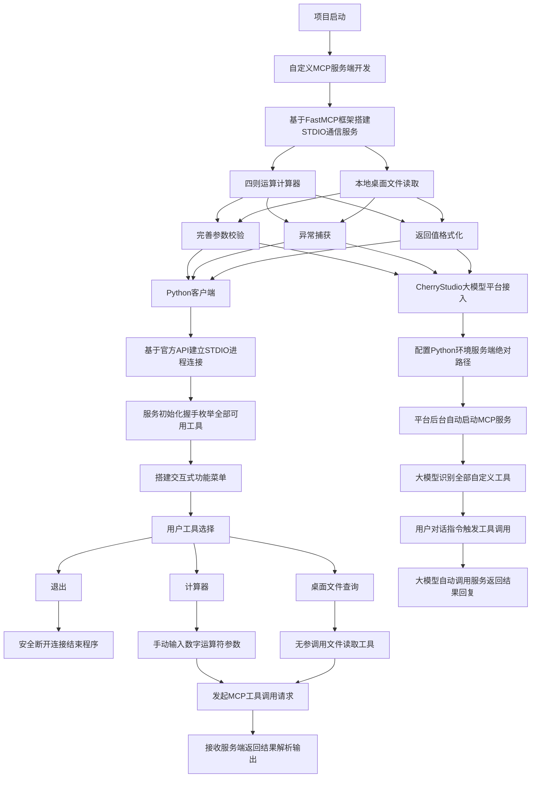

# MCP

## 一、MCP简介

MCP 是一种开放协议，用于标准化大模型与外部工具、数据、应用的交互方式。核心目标是让大模型不仅能对话，还能直接执行任务，如访问数据库、调用API、操作文件系统等，从而实现真正的自然语言编程。

## 二、项目简介

本项目基于 MCP协议，完成自定义 MCP 服务端开发、原生 Python 客户端实现、大模型平台接入全流程开发。

项目实现四则运算计算器、本地桌面文件读取**两个自定义工具服务，基于 FastMCP 框架搭建标准 STDIO 通信模式的服务端；自研异步 Python 客户端，实现服务连接、工具枚举、参数传入调用、结果解析全流程交互，支持交互式菜单选择、自定义参数输入、程序安全退出。

## 三、流程图



## 四、环境配置

### （一）创建虚拟环境

```
conda create -n MCP python=3.13
```

```
conda activate MCP
```

### （二）安装 MCP 依赖

```
pip install mcp
```

```
pip install mcp[cli]
```

## 五、MCP 服务端

### （一）mcp_server.py

```
import os
import sys
from mcp.server.fastmcp import FastMCP

print("🚀 MCP 服务启动中...", file=sys.stderr)
mcp = FastMCP("FileSystem")

@mcp.tool()
def get_desktop_files() -> list:
    desktop = r"E:\整理\桌面"
    try:
        if not os.path.exists(desktop):
            return ["桌面路径不存在"]
        files = os.listdir(desktop)

        if len(files) == 0:
            return ["当前桌面文件夹为空"]
        return files
    except Exception as e:
        print(f"Error: {e}", file=sys.stderr)
        return [f"读取异常：{str(e)}"]

@mcp.tool()
def calculator(a: float, b: float, operator: str) -> float:
    """执行基础数学运算（支持+-*/）"""
    if operator == '+':
        return a + b
    elif operator == '-':
        return a - b
    elif operator == '*':
        return a * b
    elif operator == '/':
        if b == 0:
            raise ValueError("除数不能为零")
        return a / b
    else:
        raise ValueError(f"无效运算符: {operator}")

if __name__ == "__main__":
    print("✅ MCP 服务准备就绪，等待连接...", file=sys.stderr)
    mcp.run(transport='stdio')
```

### （二）启动 MCP 服务端

```
cd [文件路径]
```

```
python mcp_server.py
```

### （三）用 MCP 调试工具查看服务

```
cd [文件路径]
```

```
mcp dev tmcp_server.py
```

### （四）注意事项

更改过桌面位置，需要修改desktop 为桌面当前路径

## 六、MCP 客户端

### （一）mcp_client.py

```
import asyncio
from mcp import ClientSession, StdioServerParameters
from mcp.client.stdio import stdio_client

async def main():
    print("🔌 正在连接 MCP 服务端...")

    server_params = StdioServerParameters(
        command="python",
        args=["mcp_server.py"],
        env=None
    )

    async with stdio_client(server_params) as (read_stream, write_stream):
        async with ClientSession(read_stream, write_stream) as session:
            await session.initialize()
            print("✅ MCP 服务连接成功！")

            tools = await session.list_tools()
            tool_list = tools.tools

            while True:
                print("\n===== MCP 工具菜单 =====")
                print("1. 查看桌面文件列表")
                print("2. 使用计算器")
                print("0. 退出程序")
                choice = input("请选择功能（0/1/2）：")

                # 退出
                if choice == "0":
                    print("👋 正在退出...")
                    break

                # 查看桌面文件
                elif choice == "1":
                    print("\n🖼️ 获取桌面文件列表...")
                    file_result = await session.call_tool(
                        name="get_desktop_files",
                        arguments={}
                    )
                    if len(file_result.content) > 0:
                        print(f"桌面文件：{file_result.content[0].text}")
                    else:
                        print("桌面文件：空或读取失败")

                # 计算器
                elif choice == "2":
                    try:
                        print("\n🧮 计算器模式")
                        a = float(input("请输入第 1 个数字："))
                        b = float(input("请输入第 2 个数字："))
                        op = input("请输入运算符（+ - * /）：")

                        calc_result = await session.call_tool(
                            name="calculator",
                            arguments={
                                "a": a,
                                "b": b,
                                "operator": op
                            }
                        )
                        print(f"✅ 结果：{calc_result.content[0].text}")
                    except Exception as e:
                        print(f"❌ 计算失败：{str(e)}")

                else:
                    print("⚠️ 无效选项，请重新输入！")

    print("\n🎉 已断开连接，程序结束！")

if __name__ == "__main__":
    asyncio.run(main())
```

### （二）运行客户端

保证mcp_server.py在运行状态

```
python mcp_client.py
```

## 七、接入到Cherry Studio

### （一）接入步骤

设置 → MCP 服务器 → 添加服务器

|   类别   |                    参考                    |                             说明                             |
| :------: | :----------------------------------------: | :----------------------------------------------------------: |
|   名称   |                MyCustomMCP                 |                        自己取名就可以                        |
|   类型   |          标准输入 / 输出 (stdio)           | 操作系统为每个程序，默认打开的三个标准文件流，是程序和外界进行数据交互最基础的通道 |
|   命令   |    E:\ProgramData\anaconda3\python.exe     |                   Python 解释器的绝对路径                    |
|   参数   | E:\python\大模型应用开发\MCP\mcp_server.py |                MCP 服务端python文件的绝对路径                |
| 环境变量 |             PYTHONUNBUFFERED=1             | 强制关闭 Python 所有标准输出 (stdout)、标准错误 (stderr) 的缓冲区 |

### （二）检验

选择MCP服务器后，输入

```
帮我使用MyCustomMCP计算7*9
```

```
帮我使用MyCustomMCP列出我桌面的文件
```

